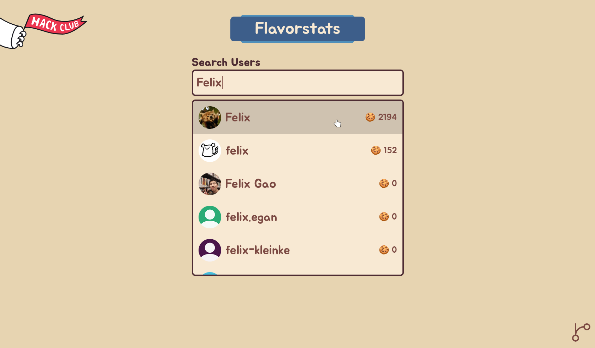
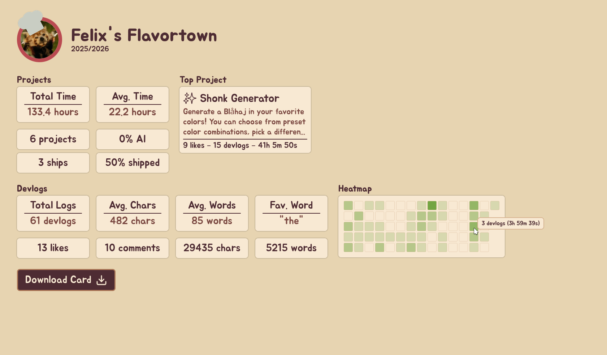

# [Flavorstats](https://flavorstats.netlify.app)

View your, or other peoples Flavortown statistics and generate a pretty card to showcase!

## How does this work?

With the help of [Flavortown's API](https://flavortown.hackclub.com/api/v1/docs), the [back-end](https://github.com/Felix-HC/Flavorstats-Backend) pulls general, and project information about the specified user. Then it proceeds to combine that information and return it as a structured JSON. This includes data like the users total votes, likes, comments, logged time, etc. After the front-end pulls that data from my API, the user gets a pretty overview and can download a card that is drawn by a HTML canvas and then exported as a PNG using the [`HTMLCanvasElement.toDataURL()`](https://developer.mozilla.org/en-US/docs/Web/API/HTMLCanvasElement/toDataURL) method.

## Images

### Search

### Overview

## License

This project is licensed under [MIT](./LICENSE).